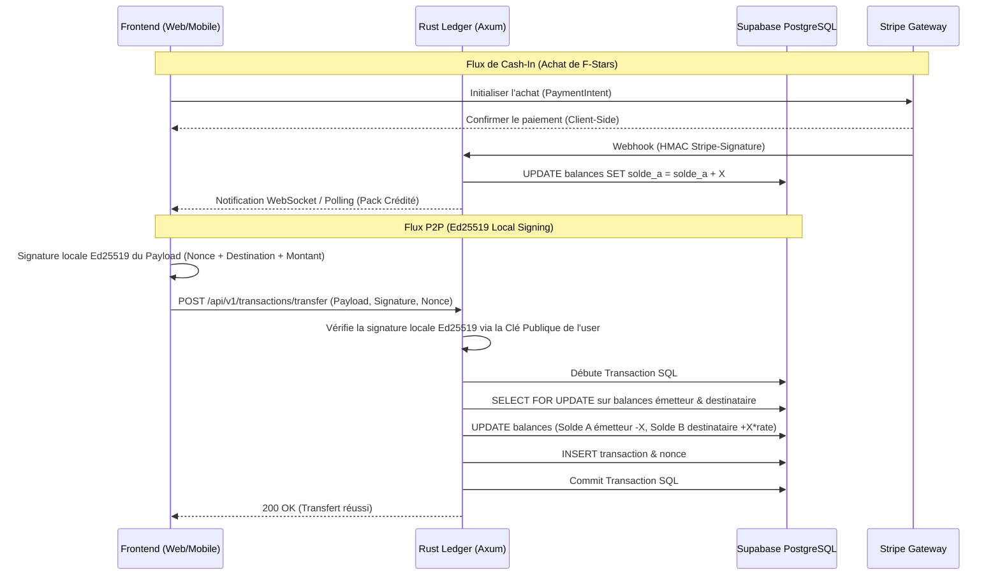

# Analyse Détaillée du Répertoire : FPay / Magic Stars

Ce document présente une analyse technique détaillée du répertoire **fpay-magic-stars**, qui contient trois projets distincts formant un écosystème de paiement en circuit fermé :
1. **Le Projet Web Frontend** (à la racine)
2. **L'Application Mobile** (dans [mobile_app](file:///c:/Users/Kali/Desktop/aheshman/fpay-magic-stars/mobile_app))
3. **Le Backend Ledger Rust** (dans [serveurblock](file:///c:/Users/Kali/Desktop/aheshman/fpay-magic-stars/serveurblock))

---

## 🗺️ Architecture Globale de l'Écosystème

L'écosystème FPay est conçu comme un système de paiement transactionnel en **circuit fermé** (aucun cash-out externe n'est autorisé).
* **Cash-In (Entrée d'argent)** : Effectué via Stripe (achat de packs de jetons appelés **F-Stars** par carte bancaire).
* **Identity Layer & Sécurité** : Repose sur une cryptographie locale **Ed25519** (non-custodial). Les transactions P2P sont signées localement par la clé privée de l'expéditeur.
* **Double Solde** :
  * **Solde A (F-Stars)** : Packs achetés via Stripe, transférables en P2P.
  * **Solde B (Gains/Credits)** : Reçu par le destinataire lors d'un transfert P2P (converti au taux de $1\text{ F-Star} = 10\text{ Ariary}$). Ce solde est consommé uniquement via un paiement marchand ou la génération de bons d'achat (Vouchers).

---

## 1. 🌐 Le Projet Web Frontend (Racine)

Ce projet est l'application web principale permettant aux membres de la communauté, créateurs et marchands de gérer leurs profils, d'acheter des F-Stars et d'effectuer des transactions.

### 🛠️ Stack Technique
* **Framework** : React 19 + Vite 7
* **Langage** : TypeScript 5.8
* **Routage** : **TanStack Router** (routage basé sur les fichiers via plugin Vite)
* **State Management** : **TanStack Query** (React Query) pour les futurs requêtes API, et un **React Context** (`FPayProvider`) pour simuler le Ledger en mémoire.
* **Styling & UI** : Tailwind CSS v4 (`@tailwindcss/vite`) + **shadcn/ui** (primitives Radix UI + class-variance-authority).
* **Librairies Annexes** :
  * `tweetnacl` & `tweetnacl-util` : Gestion de la cryptographie Ed25519 (génération de paires de clés, signature de payloads).
  * `lucide-react` : Bibliothèque d'icônes.
  * `recharts` : Graphiques financiers et statistiques de gains.
  * `sonner` : Notifications et toasts utilisateurs.
  * `zod` : Validation de schémas.

### 📁 Structure des Fichiers Clés
* [package.json](file:///c:/Users/Kali/Desktop/aheshman/fpay-magic-stars/package.json) : Contient les scripts et dépendances frontend (React 19, Tailwind v4, TanStack, tweetnacl).
* [vite.config.ts](file:///c:/Users/Kali/Desktop/aheshman/fpay-magic-stars/vite.config.ts) : Configure les plugins Vite (`TanStackRouterVite`, `react`, `tailwindcss`) et l'alias `@/`.
* [src/main.tsx](file:///c:/Users/Kali/Desktop/aheshman/fpay-magic-stars/src/main.tsx) : Point d'entrée de l'application React.
* [src/router.tsx](file:///c:/Users/Kali/Desktop/aheshman/fpay-magic-stars/src/router.tsx) : Initialise le routeur TanStack.
* [src/routes/](file:///c:/Users/Kali/Desktop/aheshman/fpay-magic-stars/src/routes) :
  * [__root.tsx](file:///c:/Users/Kali/Desktop/aheshman/fpay-magic-stars/src/routes/__root.tsx) : Layout racine qui injecte les providers globaux (`QueryClientProvider`, `FPayProvider`, `Toaster`).
  * [index.tsx](file:///c:/Users/Kali/Desktop/aheshman/fpay-magic-stars/src/routes/index.tsx) : Landing page présentant les fonctionnalités de FPay.
  * [dashboard.tsx](file:///c:/Users/Kali/Desktop/aheshman/fpay-magic-stars/src/routes/dashboard.tsx) : Dashboard principal structuré en 5 onglets (Accueil, Acheter, Envoyer, Recevoir, Payer).
* [src/hooks/use-fpay.tsx](file:///c:/Users/Kali/Desktop/aheshman/fpay-magic-stars/src/hooks/use-fpay.tsx) :
  * Définit les structures de données (`Profile`, `Transaction`, `Wallet`).
  * Gère l'état global simulé (double solde, profils pré-remplis : `USER` "Jean-Luc", `CREATOR` "Clara Stream", `MEMBER` "Olivia Art").
  * Expose les méthodes métiers principales : `generateWallet`, `buyFstart` (Stripe/Mobile Money), `transferP2P` (signature locale Ed25519), `rewardMember`, `externalTransfer`.
* [src/components/ui/](file:///c:/Users/Kali/Desktop/aheshman/fpay-magic-stars/src/components/ui) : Suite complète de 46 composants shadcn/ui pré-configurés (accordeons, formulaires, dialogs, charts, sidebars, etc.).

---

## 2. 📱 L'Application Mobile (`mobile_app`)

Un projet d'application mobile compagnon destiné aux utilisateurs en déplacement (par exemple, pour flasher un QR code chez un marchand).

### 🛠️ Stack Technique
* **Framework** : **Expo v56** (React Native)
* **Langage** : TypeScript
* **Styling** : **NativeWind v4** (implémentation Tailwind CSS pour React Native)
* **Librairies Spécifiques** :
  * `expo-camera` : Accès à l'appareil photo (prévu pour le scan de QR codes marchands/profils).
  * `expo-secure-store` : Stockage sécurisé sur l'appareil (idéal pour sauvegarder la clé privée Ed25519 de manière non-custodial).
  * `react-native-reanimated` : Animations fluides de l'interface.
  * `lucide-react-native` : Icônes vectorielles.

### 📁 Structure des Fichiers Clés
* [mobile_app/package.json](file:///c:/Users/Kali/Desktop/aheshman/fpay-magic-stars/mobile_app/package.json) : Dépendances et scripts de démarrage Expo (`npm run android`, `npm run ios`, `npm run web`).
* [mobile_app/App.tsx](file:///c:/Users/Kali/Desktop/aheshman/fpay-magic-stars/mobile_app/App.tsx) : Code de démarrage (actuellement une vue boilerplate simple).
* [mobile_app/index.ts](file:///c:/Users/Kali/Desktop/aheshman/fpay-magic-stars/mobile_app/index.ts) : Enregistre le composant racine de l'application Expo.
* [mobile_app/tailwind.config.js](file:///c:/Users/Kali/Desktop/aheshman/fpay-magic-stars/mobile_app/tailwind.config.js) : Configuration NativeWind pour cibler les fichiers JS/TSX.
* [mobile_app/AGENTS.md](file:///c:/Users/Kali/Desktop/aheshman/fpay-magic-stars/mobile_app/AGENTS.md) : Note rappelant de suivre la documentation d'Expo v56.

> [!NOTE]
> L'application mobile est actuellement à l'état de squelette fonctionnel (boilerplate d'initialisation). Elle possède tous les packages nécessaires pour implémenter le scan de QR codes et la gestion sécurisée des clés de paiement.

---

## 3. 🖥️ Le Backend Ledger Rust (`serveurblock`)

Ce dossier contient les **spécifications techniques** et l'**architecture v5** du futur ledger transactionnel décentralisé. Aucun code Rust n'est encore écrit, mais la planification est extrêmement rigoureuse.

### 🛠️ Stack Rust Planifiée
* **Web Framework** : `axum` v0.7 (REST API, CORS, Tower HTTP)
* **Runtime** : `tokio` (asynchrone)
* **Database Driver** : `sqlx` v0.8 (PostgreSQL avec support asynchrone, UUIDs et macros de requêtes)
* **Cryptographie** :
  * `ed25519-dalek` v2.1 : Validation des signatures de transactions reçues du client.
  * `aes-gcm` v0.10 : Chiffrement symétrique AES-256-GCM des données KYC sensibles en base de données.
  * `jsonwebtoken` v9.3 : Validation des JSON Web Tokens émis par **Supabase Auth**.
* **Base de Données** : **Supabase** (PostgreSQL géré) avec l'extension `pg_cron` pour nettoyer périodiquement les nonces expirés.

### 📂 Modèle de Données Planifié (Base de Données)
La structure PostgreSQL s'articule autour de tables clés :
1. **`profiles`** : Stocke les informations utilisateurs (mappées sur le `sub` du JWT Supabase Auth), le rôle (`user`, `creator`, `merchant`, `admin`), le statut KYC (`pending`, `verified`, `suspended`), la clé publique Ed25519, ainsi que les données KYC chiffrées (`encrypted_email`, `encrypted_phone`).
2. **`balances`** : Table séparée pour éviter les verrouillages inutiles sur les profils. Gère `solde_a` (F-Stars) et `solde_b` (Gains). Des contraintes PostgreSQL de type `CHECK` garantissent qu'aucun solde ne devienne négatif.
3. **`nonces`** : Stocke les nonces de transactions à usage unique (avec expiration) pour contrer les **attaques par rejeu**.
4. **`transactions`** : Historique immuable contenant le type de transaction (`achat`, `transfert`, `payement_marchand`, `voucher`), les montants débités/crédités, les frais prélevés (ex: 1.5% sur réception marchand), et les clés de signature.
5. **`encryption_keys`** : Table de rotation de la clé maître AES.

### 🛡️ Mécanisme de Sécurité Métier
Le ledger implémente plusieurs couches de protection :
* **KYC Obligatoire** : Toute transaction nécessite un profil `kyc_status = 'verified'`. Pour un transfert P2P, l'expéditeur et le destinataire doivent être vérifiés.
* **Anti-Race Condition** : Combinaison d'un verrouillage pessimiste SQL (`SELECT ... FOR UPDATE` sur la ligne de balance) et de contraintes au niveau de la base de données.
* **Anti-Rejeu** : Chaque transaction client doit inclure un timestamp et un nonce unique signé par la clé Ed25519 de l'utilisateur. Si le nonce a déjà été utilisé ou si le timestamp date de plus de 5 minutes, le backend Rust rejette la requête.

---

## 🔄 Relations & Flux d'Intégration Futurs

Voici comment les trois sous-projets s'interconnecteront :

---

## 📌 Résumé de l'État d'Avancement

| Projet | Avancement | Actions Requises |
|---|---|---|
| **Vite/React Web** (Racine) | **~90% (Prêt pour intégration)** | Remplacer le context mocké ([use-fpay.tsx](file:///c:/Users/Kali/Desktop/aheshman/fpay-magic-stars/src/hooks/use-fpay.tsx)) par des requêtes Axios/Fetch vers le serveur Axum et brancher Supabase Auth. |
| **Expo Mobile** (`mobile_app`) | **~10% (Structure initiale)** | Développer les écrans de scan QR, de transfert mobile et l'écriture sécurisée de la clé privée Ed25519. |
| **Rust Ledger** (`serveurblock`) | **~5% (Planification uniquement)** | Initialiser le projet Rust (`cargo init`), écrire les migrations SQL PostgreSQL pour Supabase et implémenter l'API Axum. |
